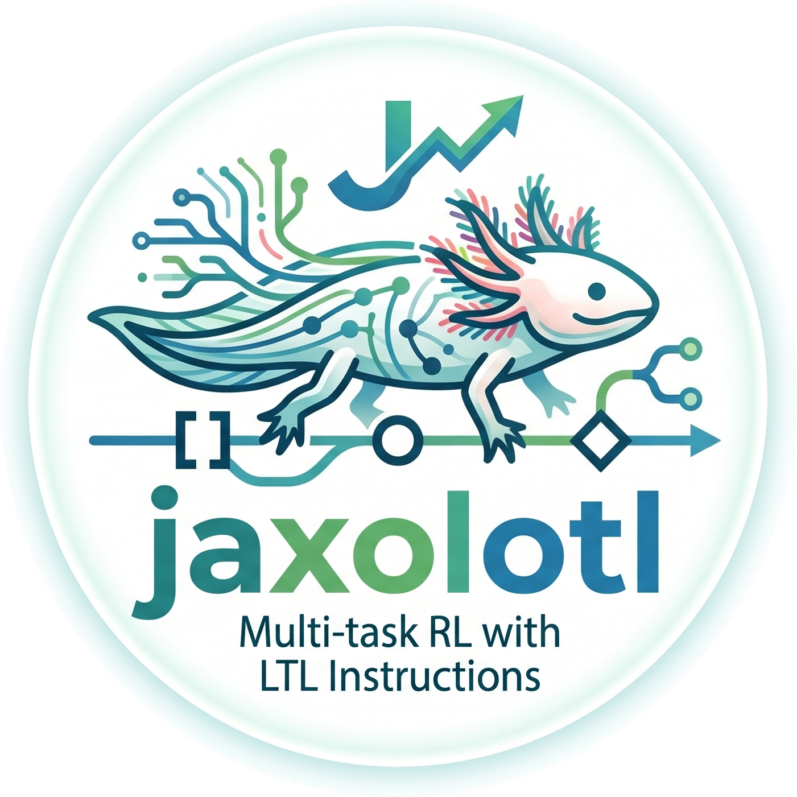

<p align="center">
    
</p>

<div align="center" style="font-size: 1.5em; font-weight: bold">
    <p><h1> Jaxolotl: A Unified High-Performance Benchmark Suite for LTL-Based Multi-Task RL</h1></p>
</div>

<div align="center">

[](https://www.python.org/downloads/release/python-3120/)
[](https://github.com/mathiasj33/jaxolotl-private/actions/workflows/tests.yml)
[](https://opensource.org/licenses/MIT)
[](https://pixi.prefix.dev/latest/)
[](https://github.com/astral-sh/ruff)
</div>


Jaxolotl is a unified framework providing high-performance [JAX](https://docs.jax.dev/en/latest/index.html) implementations of a wide range of algorithms and environments for LTL-conditioned multi-task RL. Our implementations provide speed-ups of up to 20-30x compared to standard PyTorch implementations.

<div align="center">

[**Installation 🔧**](#installation-) | [**Algorithms 🤖**]() | [**Environments 🌍**]() | [**Performance 🚀**]() | [**Getting started ⚡**](#getting-started-)

</div>

## Installation 🔧

We recommend using [pixi](https://pixi.sh/latest/) to install the required dependencies
in a virtual environment. Installing on GPU is highly recommended:
```bash
pixi install -e gpu
pixi run -e gpu copy-templates
```

To install the pretrained models:
```bash
pixi run -e gpu install-pretrained-models
```

### Rabinizer 4

We use [Rabinizer 4](https://www7.in.tum.de/~kretinsk/rabinizer4.html) for the
conversion of LTL formulae into LDBAs. Download the program using [this
link](https://www7.in.tum.de/~kretinsk/rabinizer4.zip) and unzip it into the
`dependencies` subfolder. Rabinizer requires Java 17 to be installed on your system and
`$JAVA_HOME` to be set accordingly. You can install Rabinizer with the following commands:
```bash
mkdir -p dependencies \
    && curl -L https://www7.in.tum.de/~kretinsk/rabinizer4.zip -o rabinizer4.zip \
    && unzip -q rabinizer4.zip -d dependencies \
    && rm -f rabinizer4.zip
```

To test the installation, run the following:
```bash
./dependencies/rabinizer4/bin/ltl2ldba -h
```
which should print a help message.
We tested the implementation with OpenJDK 21.0.11.

### SemML

The SemLTL algorithm additionally requires [SemML](https://gitlab.com/live-lab/software/semml/-/tree/semerl?ref_type=heads) for the construction of semantically labelled LDBAs (note that this is not required for other algorithms). We include SemML as a git submodule of this repository. It can be installed as follows:
```bash
git submodule init
git submodule update
pixi run python semml/build.py
ln -s "$(pwd)/semml" dependencies/semml
```

To test the installation, run the following command, which should output an LDBA in HOA format if everything is configured correctly:
```bash
pixi run python dependencies/semml/scripts_semml/embedd_ldba.py --formula="F a" --aps="a,b" --eligibleLetters="[[a],[b]]" --outputPath="tmp.hoa" && cat dependencies/semml/tmp.hoa && rm dependencies/semml/tmp.hoa
```

### Docker
We alternatively provide a Dockerfile to build an image with all required dependencies:
```bash
docker build -t jaxolotl:gpu .
```
Note that the container only installs SemLTL dependencies if you have initialised the SemML submodule via `git submodule init && git submodule update`. Otherwise the SemLTL installation will be skipped.

Note that this is a GPU-enabled image and requires a working [Docker](https://www.docker.com/) and [NVIDIA container toolkit](https://docs.nvidia.com/datacenter/cloud-native/container-toolkit/latest/install-guide.html) installation.

We recommend mounting `runs` and `data` directories for preservation:
```bash
mkdir data runs
docker run --rm -it --gpus all \
  --shm-size=2g \
  --mount type=bind,src="$PWD/data",dst=/workspace/data \
  --mount type=bind,src="$PWD/runs",dst=/workspace/runs \
  jaxolotl:gpu
```

## Algorithms 🤖

**Algorithm** | Finite | Infinite | Non-myopic | Curriculum | Task representation | Paper | Code
--- | --- | --- | --- | --- | --- | --- | ---
LTL2Action | ✅ | ❌ | ✅ | ✅ | Formula syntax tree | [Link](https://arxiv.org/abs/2102.06858) | [Link](src/jaxolotl/alg/ltl2action)
DeepLTL | ✅ | ✅ | ✅ | ✅ | Reach-avoid sequence | [Link](https://arxiv.org/abs/2410.04631) | [Link](src/jaxolotl/alg/deep_ltl)
GenZ-LTL | ✅ | ✅ | ❌ | ❌ | Reach-avoid subgoal / observation reduction | [Link](https://arxiv.org/abs/2508.01561) | [Link](src/jaxolotl/alg/genz_ltl)
SemLTL | ✅ | ✅ | ✅ | ✅ | Semantically labelled LDBA | [Link](https://arxiv.org/abs/2602.06746) | [Link](src/jaxolotl/alg/sem_ltl)
StructLTL | ✅ | ✅ | ✅ | ✅ | Boolean reach-avoid sequence | [Link](https://arxiv.org/abs/2602.14344) | [Link](src/jaxolotl/alg/struct_ltl)

## Environments 🌍

**Environment** | Observation space | Action space | Paper | Code
--- | --- | --- | --- | ---
LetterWorld | Grid (7 × 7 × 13) | Discrete (4 directions) | [Link](https://arxiv.org/abs/2102.06858) | [Link](src/jaxolotl/environments/letter_world)
ZoneEnv | Proprioception + lidar (69D) | Continuous (2D) | [Link](https://arxiv.org/abs/2102.06858) | [Link](src/jaxolotl/environments/zone_env)
ZoneEnv-NM | Proprioception + lidar (69D) | Continuous (2D) | [Link](https://arxiv.org/abs/2602.14344) | [Link](src/jaxolotl/environments/zone_env)
Warehouse | Proprioception + lidar + region/inventory features (47D) | Hybrid (2D continuous + 5 discrete) | [Link](https://arxiv.org/abs/2602.14344) | [Link](src/jaxolotl/environments/warehouse_env)
ConveyorWorld | Position (2D) | Discrete (4 directions) | [Link](https://arxiv.org/abs/2602.06746) | [Link](src/jaxolotl/environments/conveyor_world)

## Getting Started ⚡

We use [Hydra](https://hydra.cc/docs/intro/) to configure experiments. The below
commands assume you want to train and evaluate StructLTL for the Warehouse
environment. Select the algorithm and environment via `alg` and `env` configuration keys. Hydra loads the matching `${env}/${alg}` configuration from `conf/experiment`.

### Precomputing Resets

For efficiency, we precompute the environment resets for both training and evaluation:
```bash
pixi run -e gpu python scripts/precompute_resets.py env=warehouse split=train
pixi run -e gpu python scripts/precompute_resets.py env=warehouse split=test
```

For LTL2Action and SemLTL, we also recommend precomputing the training curriculum:
```bash
pixi run -e gpu python scripts/precompute_curriculum.py alg=ltl2action env=warehouse num_parallel=4
```
where `num_parallel` can be used to speed up processing. This can take a while to complete.

### Training

To train a policy:
```bash
pixi run -e gpu python scripts/train.py alg=struct_ltl env=warehouse run=tmp
```
This script stores the following training outputs in `runs/${env}/${alg}/${run}`:

- `logs.csv` and `train.log` contain training logs.
- `models.eqx` contains the final trained models (batched across seeds).
- `checkpoints` cointains training checkpoints. Checkpointing frequency can be controlled with the `save_freq` parameter.

To plot training performance:
```bash
pixi run -e gpu python scripts/plotting/plot_training_curves.py
```
**NOTE**: you will need to edit which runs to plot inside `scripts/plotting/plot_training_curves.py`

> [!NOTE]
> If you run into OOM errors, reduce the `num_seeds` that are trained in parallel. You can combine trained models from different runs with [combine_models.py](scripts/combine_models.py).

### Evaluation

To evaluate the trained models:
```bash
pixi run -e gpu python scripts/eval/eval.py alg=struct_ltl env=warehouse formula_type=finite run=tmp
```

Pretrained models can be evaluated with `run=pretrained` (once they have been installed). See [eval.yaml](conf/eval.yaml.template) for other configuration options.

> [!NOTE]
> If you run into OOM errors, the eval script supports `models_per_batch` and `formulas_per_batch` to control the evaluation parallelism. Lowering these will reduce memory requirements, at the expense of longer runtimes.

> [!TIP]
> All formulae used in the paper are provided in `conf/formulas`.

To visualize trajectories for the trained policy on an LTL formula (both for drawing trajectories and rendering them in real-time):
```bash
pixi run -e gpu python scripts/eval/visualize_trajectories.py alg=struct_ltl env=warehouse run=pretrained eval.formula="F (vase & region_a & X(!vase & region_a))"
```

To compute evaluation curves:
```bash
pixi run -e gpu python scripts/eval/compute_eval_curves.py alg=struct_ltl env=warehouse formula_type=finite run=tmp
```

Note that only final pretrained models are provided, so evaluation curves can only be computed for new runs.

To plot evaluation curves:
```bash
pixi run -e gpu python scripts/plotting/plot_eval_curves.py
```
**NOTE**: you will need to edit which runs to plot inside `scripts/plotting/plot_eval_curves.py`

### Ablation Studies

This repository includes code for reproducing the ablation studies D.2.1 and D.2.2. See `conf/experiment/warehouse/tokenized_ltl.yaml` for a configuration of StructLTL with a flat sequence model, and `conf/experiment/warehouse/gcn_ltl.yaml` for the GNN configuration. To train StructLTL with a GRU encoder instead of the attention mechanism, specify `model/sequence=gru`.

## License

This project is licensed under the terms of the [MIT License](/LICENSE).

## Citation

If you find this code useful in your research, please consider citing our paper:
```bibtex
@inproceedings{jaxolotl,
    title     = {Jaxolotl: {A} Unified High-Performance Benchmark Suite for {LTL}-Based Multi-Task {RL}},
    author    = {Mathias Jackermeier and Jacques Cloete and Alessandro Abate},
    booktitle = {arXiv},
    year      = {2026}
}
```
